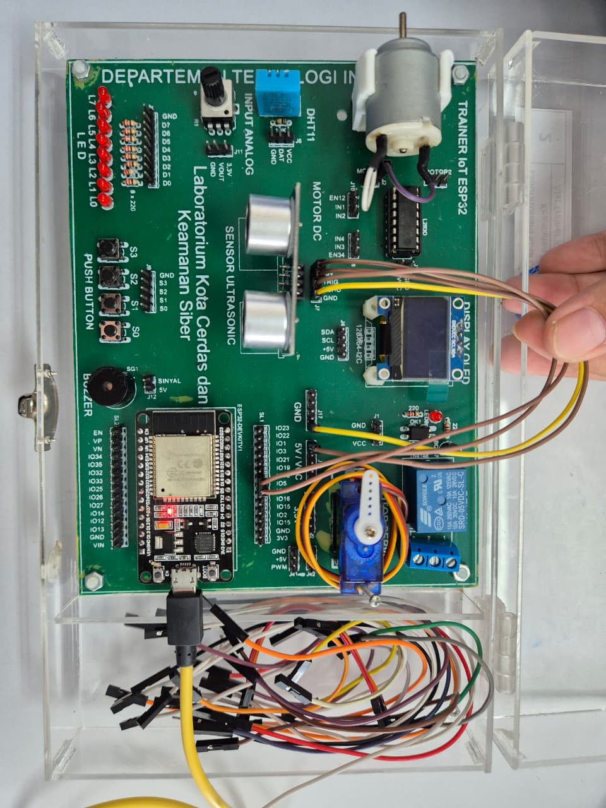
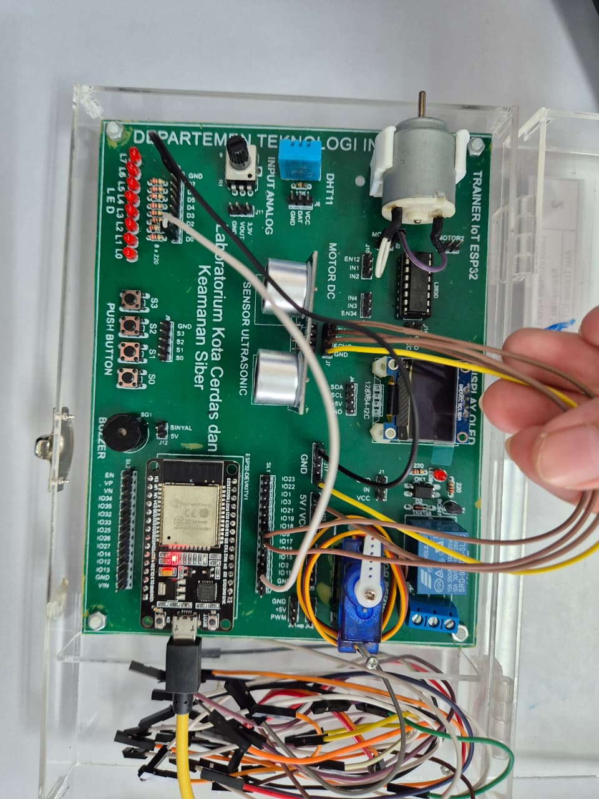
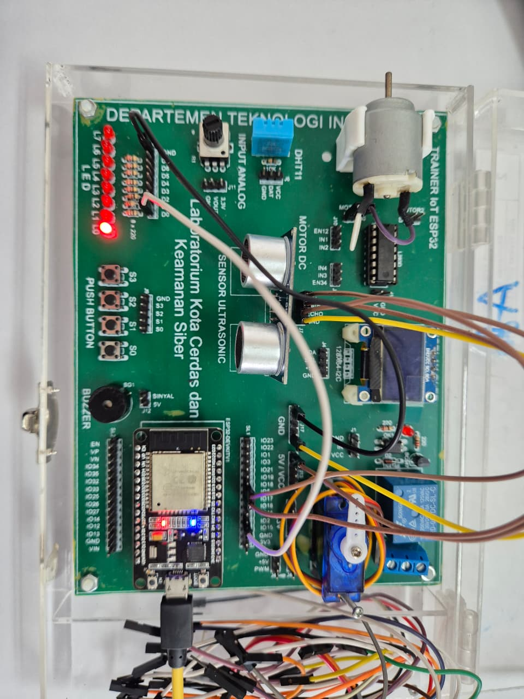
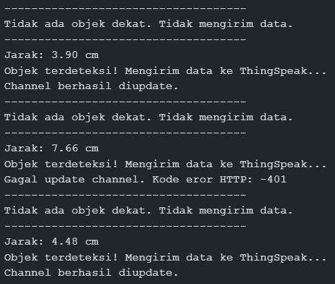
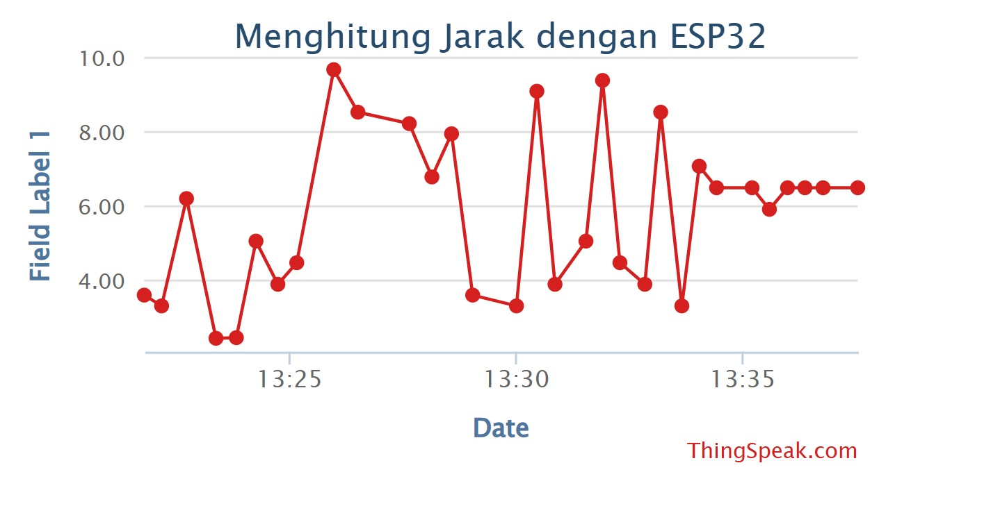

# Laporan-IOT-058-084

## 📌 Informasi Umum
**Judul Proyek: Mengukur Jarak dengan ESP32**
**Anggota:**  
| Nama                      | NRP        |
| --------------------------| ---------- |
| Ica Zika Hamizah          | 5027241058 |
| Oryza Qiara Ramadhani     | 5027241084 |

**Platform/Board: ESP32**
**Bahasa Pemrograman: C++** 
**Topik: Mengukur Jarak**

---

## 🎯 Tujuan Proyek
- Memantau suhu dan kelembaban secara real-time.  
- Mengirim data sensor ke Thingspeak. 

---

## 🛠️ Alat dan Bahan
- **Hardware:**   
  - [ESP32]  
  - [HC-SR04] 
  - [LED]  
  - [Kabel Jumper]  

- **Software:**  
  - [Arduino IDE]  
  - [C++]  
  - [ThingSpeak]  

---

## 📐 Diagram Sistem
```text
    +-----------+
    |  Sensor   |
    | HC-SR04   |
    +-----+-----+
          |
          v
 +-----------------+
 | Microcontroller |
 |      ESP32      |
 +-----------------+
 |  - Baca sensor  |
 |  - Proses data  |
 |  - Kontrol LED  |
 +--------+--------+
          |
          v
   +--------------+
   |  Internet    |
   |   (WiFi)     |
   +------+-------+
          |
          v
    +------------+
    | ThingSpeak |
    |  Channel   |
    +------------+
          |
          v
    +-------------+
    | Dashboard   |
    | (Grafik /   |
    |  Monitoring)|
    +-------------+
```
### 💡 Penjelasan Alur Data
1. **HC-SR04** mengukur jarak dan mengirim data ke ESP32.  
2. **ESP32** membaca data, memprosesnya, dan bisa menyalakan LED jika jarak tertentu tercapai.  
3. ESP32 mengirim data ke **ThingSpeak** melalui WiFi (HTTP POST/MQTT).  
4. **ThingSpeak Channel** menyimpan data sensor.  
5. **Dashboard ThingSpeak** menampilkan data real-time dalam bentuk grafik.  

## [gambar] Penjelasan Code

Kode berikut digunakan untuk membaca jarak menggunakan sensor ultrasonik (HC-SR04) yang terhubung ke ESP32, menyalakan LED jika objek terdeteksi pada jarak tertentu, serta mengirimkan data jarak tersebut ke ThingSpeak untuk dicatat dan divisualisasikan.

### Library yang Digunakan
```cpp
#include <WiFi.h>
#include "ThingSpeak.h" 
```
- WiFi.h → digunakan untuk menghubungkan ESP32 ke jaringan WiFi.
- ThingSpeak.h → library resmi untuk mengirim/mengambil data dari platform ThingSpeak.

### Konfigurasi WiFi & ThingSpeak
```cpp
const char ssid[] = "nama_wifi(ssid)";
const char pass[] = "password_wifi";
unsigned long myChannelNumber = 3098791;
const char * myWriteAPIKey = "IQABIJ64BYEJDYKQ";
```
- ssid → nama jaringan WiFi.
- pass → password WiFi.
- myChannelNumber → nomor channel di ThingSpeak tempat data akan dikirim.
- myWriteAPIKey → kunci API untuk autentikasi agar bisa menulis data ke channel.

### Definisi Pin
``` cpp
const int trigPin = 5;
const int echoPin = 18;
const int ledPin = 2;
```
- trigPin → pin TRIG sensor HC-SR04 (output).
- echoPin → pin ECHO sensor HC-SR04 (input).
- ledPin → pin untuk LED indikator.

### Objek WiFi Client
``` cpp
WiFiClient client;
```
- Membuat objek client yang digunakan untuk koneksi HTTP dengan server ThingSpeak.

### Setup Awal
```cpp
void setup() {
  Serial.begin(9600);
  
  pinMode(trigPin, OUTPUT);
  pinMode(echoPin, INPUT);
  pinMode(ledPin, OUTPUT);
  
  WiFi.mode(WIFI_STA);
  ThingSpeak.begin(client); 
}
```

- Serial.begin(9600) → memulai komunikasi serial untuk debugging.
- pinMode(...) → atur pin sensor dan LED sebagai input/output.
- WiFi.mode(WIFI_STA) → mengaktifkan mode station (ESP32 jadi client WiFi).
- ThingSpeak.begin(client) → inisialisasi koneksi ke ThingSpeak.

### Loop Utama - Koneksi WiFi
```cpp
if (WiFi.status() != WL_CONNECTED) {
  Serial.print("Mencoba terhubung ke SSID: ");
  Serial.println(ssid);
  while (WiFi.status() != WL_CONNECTED) {
    WiFi.begin(ssid, pass);
    Serial.print(".");
    delay(5000);
  }
  Serial.println("\nTerhubung ke WiFi.");
}
```
- Mengecek status koneksi WiFi.
- Jika belum terhubung, ESP32 akan mencoba menyambungkan ke jaringan dengan WiFi.begin().
- Status ditampilkan di Serial Monitor.

### Membaca Sensor Ultrasonik
```cpp
long duration;
float distance;

digitalWrite(trigPin, LOW);
delayMicroseconds(2);
digitalWrite(trigPin, HIGH);
delayMicroseconds(10);
digitalWrite(trigPin, LOW);

duration = pulseIn(echoPin, HIGH, 30000);
distance = duration * 0.03421 / 2;
```
Bagian ini mengaktifkan sensor ultrasonik dengan memberi pulsa singkat pada pin TRIG, lalu membaca pantulan sinyal lewat pin ECHO. Waktu pantulan disimpan dalam variabel duration, kemudian dikonversi menjadi jarak dalam satuan sentimeter menggunakan rumus distance = duration * 0.03421 / 2.

### Kondisi Jika Objek Terdeteksi
```cpp
if (distance < 10 && distance > 0) {
  Serial.print("Jarak: ");
  Serial.print(distance);
  Serial.println(" cm");
  digitalWrite(ledPin, HIGH);
  Serial.println("Objek terdeteksi! Mengirim data ke ThingSpeak...");

  int httpCode = ThingSpeak.writeField(myChannelNumber, 1, distance, myWriteAPIKey);

  if (httpCode == 200) {
    Serial.println("Channel berhasil diupdate.");
  } else {
    Serial.println("Gagal update channel. Kode eror HTTP: " + String(httpCode));
  }

  delay(10000); 
}
```
Jika jarak objek kurang dari 10 cm, maka jarak ditampilkan di Serial Monitor, LED menyala, dan data dikirim ke ThingSpeak. Jika update berhasil akan muncul pesan sukses, jika gagal ditampilkan kode error. Setelah itu ada jeda 10 detik sebelum pembacaan berikutnya.

### Kondisi Jika Tidak Ada Objek
```cpp
else {
  digitalWrite(ledPin, LOW);
  Serial.println("Tidak ada objek dekat. Tidak mengirim data.");
}
  
Serial.println("------------------------------------");

delay(1000); 
```
Jika jarak lebih dari 10 cm atau tidak terdeteksi, LED dimatikan dan pesan ditampilkan bahwa tidak ada objek. Data tidak dikirim ke ThingSpeak, lalu program menunggu 1 detik sebelum mengulangi pengukuran.


## Dokumentasi 

### Keadaan saat semua sudah tersambung
Penugasan mengukur jarak dengan ESP32 dirakit pada trainer board IoT ESP32. Komponen utama yang digunakan adalah:

- ESP32 DEVKIT V1: Berfungsi sebagai mikrokontroler utama yang menjalankan logika program, membaca sensor, mengontrol aktuator, dan terhubung ke internet (WiFi).
- Sensor Ultrasonik (HC-SR04): Digunakan untuk mengukur jarak objek dengan prinsip pantulan gelombang suara. Sensor ini mengirimkan data duration (waktu tempuh) ke ESP32.
- LED: Berfungsi sebagai indikator visual yang akan menyala ketika objek terdeteksi pada jarak kurang dari 10 cm.




### Keadaan saat ada objek didekat sensor
Ketika ada objek dekat, sensor ini akan menyalakan lampu (LED) sebagai indikasi lokal dan mencoba mengirimkan data jarak objek tersebut ke internet (ThingSpeak) untuk pemantauan jarak jauh.



### Keadaan hasil deteksi sensor
Menampilkan data jarak yang berhasil dikirimkan ke channel ThingSpeak. Grafik ini memvisualisasikan data real-time yang telah lolos validasi (jarak <10 cm).


